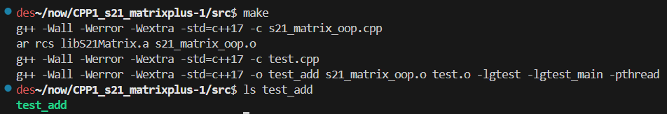
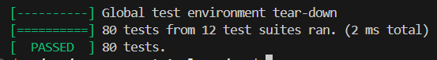
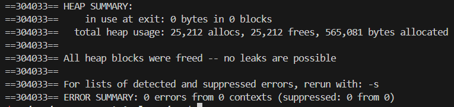
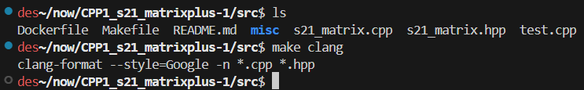
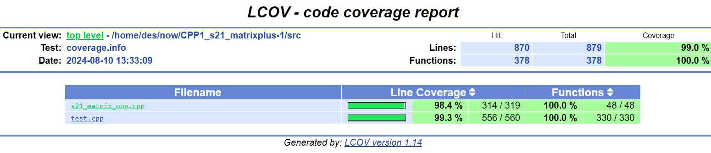

## S21_Matrix_C++
#### Made by walderhu

- Проверку сборки проекта можно с помощью команды `make`

- Запустить функциональные unit тесты с помощью `make test`

- Запустить тест на проверку утечек памяти с помощью `make memory`

- Проверить стиль с помощью `make clang`

- Запустить тесты на проверку покрытия кода `make gcov_report`
 Создастся папка *coverage_report*, в которой нужно открыть через браузер файл **index.html

 Также для удобства проверки я собрал докерфайл, который включает все необходимые утилиты и сервисы для проверки, для этого, если у вас ранее не был установлен докер выполните команду `make install_docker`, `make build`, `make run` после чего вы окажетесь в окружении докера.

Единственное,  оттуда нельзя посмотреть никак gcov репорт, но можно выйти из контейнера с помощью `Ctrl + D` и выполнить команду `make pull_report`, после чего у вас в текущей дирректории появится уже ранее изсвестаня папка coverage_report.